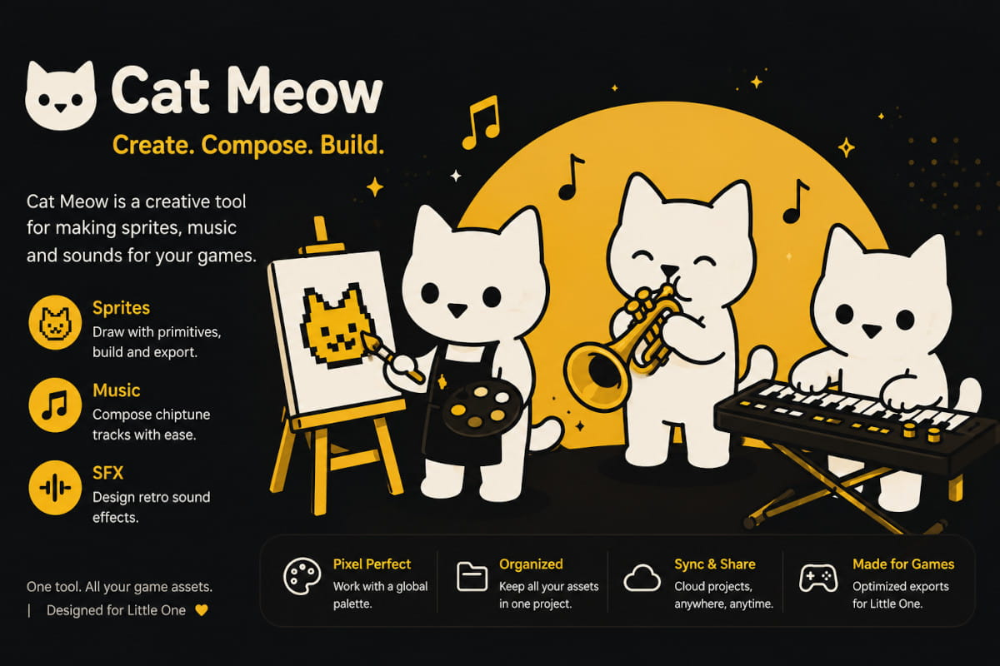

# Cat Meow Studio

<p></p>

**Cat Meow Studio (CMS)** is a procedural asset generator for tiny .kkrieger-inspired games.

It allows creating:

- procedural sprites
- procedural music
- procedural sound effects

Instead of storing PNG, WAV, OGG, or MP3 files, Cat Meow Studio stores compact source data that can be compiled directly into a game.

## Formats

- [SPRITE_FORMAT.md](./SPRITE_FORMAT.md)
- [AUDIO_FORMAT.md](./AUDIO_FORMAT.md)

## Goals

- tiny assets
- tiny source data
- tiny APKs
- fast runtime generation
- no runtime parsers

## Workflow

```text
Cat Meow Studio
        ↓
generated C source
        ↓
Little One
        ↓
runtime assets
```

## Development

```bash
npm install
npm run dev
```

## Status

Work in progress.
Currently focused on sprite, music, and sound effect generation for Little One.
